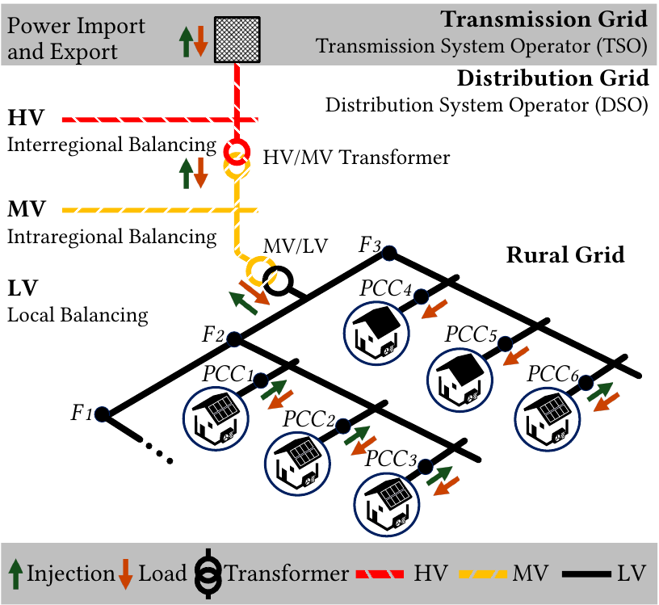

<p float="left">
  
</p>

[](https://www.python.org/downloads/release/python-3918/)
[](./LICENSE)
[](https://github.com/psf/black)
[](goekhan.demirel@kit.edu)
[](https://doi.org/10.1186/s42162-025-00489-6)


<h1 align="center">PIDE: Photovoltaic integration dynamics and efficiency for autonomous control on power distribution grids</h1>


**⚠️ Note**: *Last update on 08.07.2025*

This repository contains the Python implementation and resources to reproduce our work titled: **[PIDE: Photovoltaic Integration Dynamics and Efficiency for Autonomous Control on Power Distribution Grids](https://doi.org/10.1186/s42162-025-00489-6)**.

---
### 1. Repository Overview

<details>
  <summary>Click to expand/collapse</summary>

The provided Python-based framework, **PIDE**, implements active voltage control for low-voltage (LV) electrical distribution grids using inverter-based control of distributed energy resources (DERs). The framework supports both decentralized and distributed grid control strategies and adheres to the VDE-AR-N 4105 and EN50160 regulatory standards for providing ancillary services, such as reactive power control. 

This repository is designed to the following:

- **Reference Solution for Grid Control**: Complies with VDE regulations and enables benchmarking against AI-driven control methods.
  - **Reactive power control modes according to `VDE-AR-N 4105:2018-11`**:
    - **Q(V)**, **Q(P)**, **Fixed cos $ϕ$**
  - **Decentralized and Distributed DER grid control strategies in LV Grid**:
    - **Decentralized grid control**: Each DER unit autonomously makes decisions at the local PCC, independent of grid constraints.
    - **Distributed grid control**: All DER units along the feeder control zones coordinate the decision-making process jointly.
- **Detailed Grid Component Modelling**:
  - **Battery System Modelling**: Captures charging and discharging dynamics, state-of-charge (SoC) constraints, and energy losses during storage operations.
  - **Inverter Modelling**: Simulates reactive and active power flows, efficiency losses, and compliance with regulatory voltage constraints.
  - **Power Loss Analysis**: Incorporates active power losses in distribution lines and transformers due to DER integration, based on physical equations.
- **DER Integration and Simulation**: Provides tools to simulate DER integration and their impact on autonomous reactive power control.
  - **MPVBench**: The benchmark dataset with real-time recordings of mini-photovoltaic (MPV) systems, also known as balcony power plants, including metadata of the corresponding used hardware.
    - Visit **[MPVBench GitHub repository](https://github.com/KIT-IAI/MPVBench)** for more information.
- **Optional Monte Carlo Simulation**: Supports uncertainty modeling and sensitivity analysis using stochastic parameters for more robust and flexible evaluation of control strategies.

This repository is structured in a few key folders:

```
├── helper                                <- Directory for helper scripts.
├── yaml                                  <- Directory for configuration files.
├── LICENSE.txt                           <- Licensing information.
├── README.md                             <- Primary README for developers.
├── __main__.py                           <- Main script.
├── exe_server_helper_cs1_job.sh          <- Script executes tasks defined by the master script to the SLURM scheduler for Case Study 1.
├── exe_server_master_cs1_job.sh          <- Script submits batch jobs for Case Study 1.
├── exe_server_master_cs2_job.sh          <- Script to the SLURM scheduler for Case Study 2.
├── exe_server_master_cs3_job.sh          <- Script to the SLURM scheduler for Case Study 3.
├── execution_script_cs1.ipynb            <- Execution script for Case Study 1.
├── monte_carlo_cs1.ipynb                 <- Notebook for Case Study 1.
├── monte_carlo_cs2.ipynb                 <- Notebook for Case Study 2.
├── monte_carlo_cs3.ipynb                 <- Notebook for Case Study 3.
└── requirements.txt                      <- Dependencies required.
```

</details>

### 2. BACKGROUND 

<details>
  <summary>Click to expand/collapse</summary>

European power system hierarchy includes four primary levels: extra high voltage (220–400 kV), high voltage (**HV**, 60–220 kV), medium voltage (**MV**, 6–20 kV), and low voltage (**LV**, 230–400 V) grids, interconnected via transformers. 
The power generated from traditional large power plants and offshore wind farms feeds into the extra high and high voltage grids. 
Larger photovoltaic plants generally link to the medium voltage grid. 
Major industrial consumers directly connect to the high-voltage grid, while smaller industries connect to either the medium or low-voltage grid, depending on their specific power requirements. 



**Fig. 1: Illustration of the European Power System showing interactions and connections via transformers between the transmission grid, inclusive of extra high voltage, the distribution grid, comprising high-voltage (indicated in red), medium-voltage (shown in yellow), and LV (represented in black). Power absorption is depicted in red arrows, while power injection into the higher and lower levels is indicated with green arrows.**

</details>

### 3. Problem Formulation: V&Q Control of DERs

<details>
  <summary>Click to expand/collapse</summary>

The reactive power control indirectly influences the active power $p_{j}^{DER}$, with the separate inverters apparent powers for PV $s_{j}^{PV}$ and BES $s_{j}^{BES}$ systems determining the operating constraints:

$$
|q_{j}^{DER}| \leq \sqrt{(s_{j}^{PV})^2 - (p_{j}^{PV})^2} + \sqrt{(s_{j}^{BES})^2 - (p_{j}^{BES})^2}
$$

The voltage drop $\Delta V_{ij} = V_{i} - V_{j}$ across a distribution line connecting nodes $i$ and $j$ can be approximated using the relationship:

$$
\Delta V_{ij} = \frac{r_{ij} \left( p_{j}^{Load} - p_{j}^{DER} \right) + x_{ij} \left( q_{j}^{Load} - q_{j}^{DER} \right)}{V_{j}}
$$

where $V_{i}$ is the parent busbar's voltage, which serves as a reference value. The terms $r_{ij}$ and $x_{ij}$ denote the resistance and reactance, respectively, between buses $i$ and $j$ as depicted in Figure 2. The control strategies we've implemented for low voltage grids, as visualized below, are specifically depicted in Figure 3.


**Fig. 2: Equivalent circuit in a radial electrical distribution system including Loads, PVs, BESs, and MPVs.**


**Fig. 3: Reactive power control for DERs, schematic representation of the methods based on the actual value (AV) for active power and the PCC voltage measurement, based on VDE-AR-N 4105 Grid Code.**

</details>

### 4. Usage

<details>
  <summary>Click to expand/collapse</summary>

Execute PIDE framework by using the **[__main__.py](__main__.py)** script as shown below. 

1. **Command Line**

```bash
python __main__.py --pv_ctrl voltage_reactive_power_ctrl --storage_p_ctrl rbc_pvbes_distributed_sc_ctrl
```

```bash
python PIDE --pv_ctrl voltage_reactive_power_ctrl --storage_p_ctrl rbc_pvbes_distributed_sc_ctrl
```
2. **Run main file only**: **[__main__.py](__main__.py)**

Arguments:
| Argument                | Type    | Default Value                       | Choices                         | Help        |
|-------------------------|---------|-------------------------------------|---------------------------------|-------------|
| `--benchmark`           | str     | `simbench`                          | `simbench`, `customised`                    | Benchmark dataset: 'simbench', 'customised'.|
| `--sb_code`             | str     | `1-LV-rural1--0-sw`                 |                                             | Simbench code for the benchmark dataset.|
| `--scenario`            | str     | `2-future`                          | `0-today`, `1-near future`, `2-future`      | Scenario options: '0-today', '1-near future', '2-future'.|
| `--standard`            | str     | `vde`                               | `vde`, `customised`                         | Standards: 'vde' (VDE-AR-N 4105) or 'customised' (e.g., IEEE Std 1547-2018).|
| `--standard_mode`       | str     | `base`                              | `base`, `deadband`, `customised`            | Mode options: 'base', 'deadband', or 'customised'.|
| `--timeseries_ctrl`     | str     | `control_module`                    | `control_module`, `test_mode`, `manual`     | Timeseries control mode.|
| `--pv_ctrl`             | str     | `voltage_reactive_power_ctrl`       |`datasource`,`voltage_reactive_power_ctrl`,`power_factor_active_power_ctrl`,`constant_power_factor_active_power_ctrl` | Control mode for PV systems.|
| `--storage_p_ctrl`      | str     | `rbc_pvbes_distributed_sc_ctrl`     |`datasource`,`rbc_pvbes_decentralized_sc_ctrl`,`rbc_pvbes_distributed_sc_ctrl`,`rbc_pvbes_distributed_sc_dnc_ctrl`,`rbc_bes_dnc_ctrl` | P-Control mode for storage systems.|
| `--storage_q_ctrl`      | str     | `"voltage_reactive_power_ctrl"`     |`datasource`,`voltage_reactive_power_ctrl`,`constant_power_factor_active_power_ctrl`| Q-Control mode for storage systems.|
| `--soc_initial`         | float   | `5.0`                               | `0.00-100.00`                               | Initial state of charge (SoC) for storage systems.|
| `--scaling_pv`          | float   | `1.0`                               | `0.-10.0`                                   | Scaling factor for PV capacity (0.0-10.0).|
| `--scaling_load`        | float   | `1.0`                               | `0.-10.0`                                   | Scaling factor for load capacity (0.0-10.0).|
| `--scaling_storage`     | float   | `1.0`                               | `0.-10.0`                                   | caling factor for storage capacity (0.0-10.0).|
| `--time_mode`           | str     | `"selected"`                        | `selected`, `random`, `default`             | Time mode: 'selected', 'random', or 'default'.|
| `--episode_start_hour`  | int     | `0`                                 | `0-24`                                      | Start hour (0-24).|
| `--episode_start_day`   | int     | `179`                               | `0-354`                                     | Start day (0-354).|
| `--episode_start_min_interval`| int | `0`                               | `0-3`                                       | Starting interval (0-3).|
| `--episode_limit`       | int     | `96`                                | `0-35136`                                   | Maximum number of time steps in an episode.|
| `--max_iterations`      | int     | `35135`                             | `0-35136`                                   | Maximum number of iterations for the simulation.|
| `--flag_monte_carlo`    | lambda  | `"false"`                           | `bool`                                      | Enable or disable Monte Carlo simulation mode.|
| `--num_monte_carlo_runs`| int     | `100`                               |                                             | Number of Monte Carlo simulation runs.|
| `--seed_value`          | int     | `42`                                | `0-100`                                     | Initial seed value for Monte Carlo simulations (range 0-100)..|
| `--mpv_flag`            | lambda  | `"true"`                            | `bool`                                      | Enable or disable MPV analysis. `false` or `true`|
| `--mpv_benchmark`       | str     | `"mpvbench"`                        | `simbench`, `mpvbench`, `customised`        | MPV benchmarking source: 'simbench', 'mpvbench', or 'customised'..|
| `--mpv_scaling`                     | float            | `0.60`         | `0.-10.0`              | Scaling factor for MPV capacity (0.0-10.0).|
| `--mpv_concentration_rate_percent`  | float            | `100.00`       | `0.00-100.00`          | MPV concentration rate as a percentage (0.0-100.0).|
| `--mpv_inverter_apparent_power_watt`| int              | `800`          | `600-1000`             | Maximum apparent power for MPV inverters (600-1000 W).|
| `--mpv_solar_cell_capacity_watt`    | int              | `2000`         | `800-2000`             | Maximum power for MPV solar cells (800-2000 W).|

2. Alternatively, you can modify the arguments in the **[__main__.py](__main__.py)** file to change the default value parameters.
---
#### Configuration Files:

Additional configuration settings are available in the `yaml` directory:

- **Local Environment (`local`):**:
  - [local/user_config_grid_manage_der.yaml](yaml/local/user_config_grid_manage_der.yaml): User-defined configuration settings.
  - [local/default_config_grid_manage_der.yaml](yaml/local/default_config_grid_manage_der.yaml): Default configuration settings.

- **HPC Environment (`hpc`):**:
  - [hpc/user_config_grid_manage_der.yaml](yaml/hpc/user_config_grid_manage_der.yaml): User-defined configuration settings.
    - [hpc/default_config_grid_manage_der.yaml](yaml/hpc/default_config_grid_manage_der.yaml): Default configuration settings.

- **1. Open Configuration Files**: Locate the configuration files under the `local` and `hpc` directories.
- **2. Edit Paths**: Search for the path settings in each file and update them as follows:

  - **`local` (on Windows)**: These settings are used on a local Windows machine. 
    ```yaml
    helper_path: C:\\Users\\<username>\\PIDE\\helper 
    input_data_path: C:\\Users\\<username>\\PIDE\\input\\data
    output_data_path: C:\\Users\\<username>\\PIDE\\output\\data
    output_test_path: C:\\Users\\<username>\\PIDE\\test
    ```

  - **`hpc` (on Linux-based)**: These settings are intended for an HPC environment running on Linux. 
    ```yaml
    helper_path: /hkfs/home/haicore/iai/<username>/PIDE/helper
    input_data_path: /hkfs/home/haicore/iai/<username>/PIDE/input/data
    output_data_path: /hkfs/home/haicore/iai/<username>/PIDE/output/data
    output_test_path: /hkfs/home/haicore/iai/<username>/PIDE/test
    ```

</details>

### 5. Replicating Results:

<details>
  <summary>Click to expand/collapse</summary>

To replicate the results from the paper, follow these steps:

1. Clone the repository:

    ```bash
    git clone https://github.com/KIT-IAI/PIDE.git
    ```
2. Create a virtual environment :

    ```bash
    python3.9 -m venv pide_env
    source pide_env/bin/activate
    pip install --upgrade pip
    ```
3. Run the following command to install the packages:

    ```bash
    cd PIDE
    pip install -r requirements.txt
    ```
4. Run the provided bash scripts for each case study:
    - **For *Case Study 1***: 
        ```bash
        chmod +x ./exe_server_helper_cs1_job.sh
        chmod +x ./exe_server_master_cs1_job.sh
        sbatch ./exe_server_master_cs1_job.sh
        ```
      - Calls `exe_server_helper_cs1_job.sh` to create SLURM jobs for sensitivity analysis. 
      - Calls `execution_script_cs1.ipynb` to execute script for Case Study 1 on SLURM.  
      - Open and execute the notebook `monte_carlo_cs1.ipynb`.

    - **For *Case Study 2***: 
        ```bash
        chmod +x ./exe_server_master_cs2_job.sh 
        sbatch ./exe_server_master_cs2_job.sh
        ```
      - Open and execute the notebook `monte_carlo_cs2.ipynb`.
    - **For *Case Study 3***: 
        ```bash
        chmod +x ./exe_server_master_cs3_job.sh
        sbatch ./exe_server_master_cs3_job.sh
        ``` 
      - Open and execute the notebook `monte_carlo_cs3.ipynb`.

</details>

## License
This code is licensed under the [MIT License](LICENSE).

<h2>Citation &#128221;</h2>
<p>
If you use this framework in your research, please consider citing our paper &#128221; and giving the repository a star &#11088;:
</p>

- BibTeX format:
```bibtex
@article{Demirel2025,
  title     = {PIDE: Photovoltaic integration dynamics and efficiency for autonomous control on power distribution grids},
  author    = {Demirel, Gökhan and Fernengel, Natascha and Grafenhorst, Simon and F\"orderer, Kevin and Hagenmeyer, Veit},
  journal   = {Energy Informatics},
  volume    = {8},
  number    = {1},
  pages     = {32},
  year      = {2025},
  doi       = {10.1186/s42162-025-00489-6},
  url       = {https://doi.org/10.1186/s42162-025-00489-6}
}
```

#### Acknowledgment
This work was supported in part by:
- The Energy System Design (ESD) Project (Structure 37.12.02).
- The Helmholtz Association (HGF) Initiative and Networking Fund through Helmholtz AI.
- The HAICORE@KIT partition.
